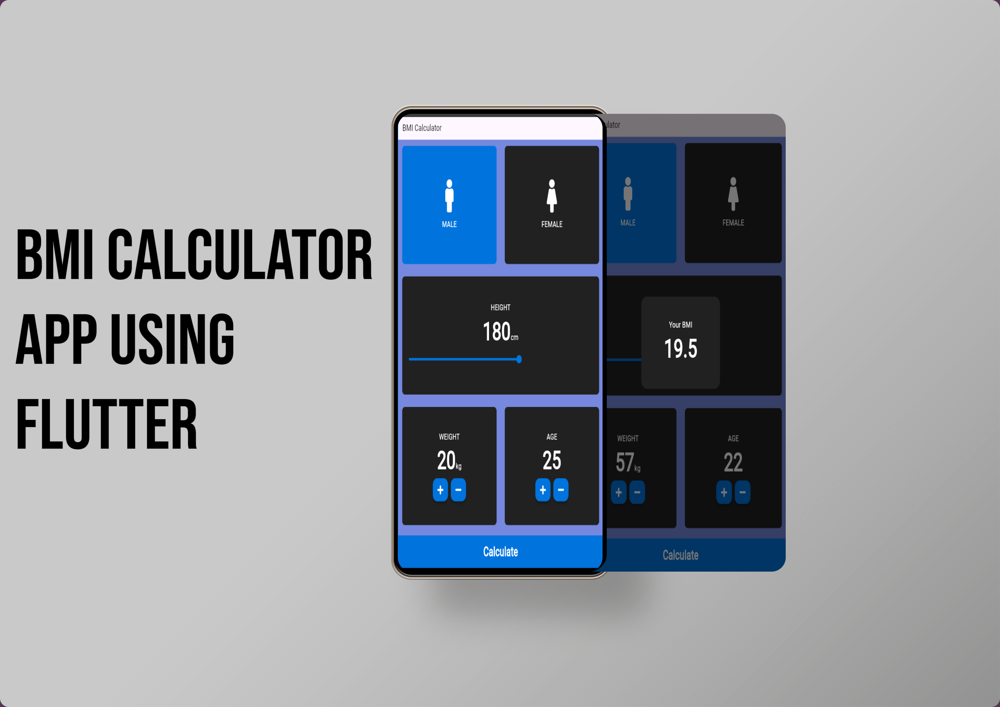

# BMI Calculator App

<p align="center">
  
</p>

This is a flutter based simple BMI Calculator app which calculated Body Mass Index..

One of the first simple apps I created while on my journey to learn Flutter.

### Dependencies

1. [Font Awesome Flutter](https://pub.dev/packages/font_awesome_flutter)

2. [Flutter Launcher Icons](https://pub.dev/packages/flutter_launcher_icons)

## Setup

  ##### Clone the repository
```bash
git clone https://github.com/Pathakdarshan12/BMI_Calculator_App_Using_Flutter.git
```
  ##### Move to the desired folder
```bash
cd \bmi_calculator
```

  ##### To run the app, simply write
```bash
flutter pub get
```

```bash
flutter run
```

## License

This project follows the [MIT License](/LICENSE).

## Contact

<p align="left">
<a href="https://www.linkedin.com/in/pathakdarshan12/" target="blank">
    
</a>
<a href="https://x.com/_Pathak_Darshan" target="blank">
    
</a>
<a href="https://www.instagram.com/pathakdarshan12/" target="blank">
    
</a>
<a href="mailto:pathakdarshan12@gmail.com" target="blank">
    
</a>
</p>

